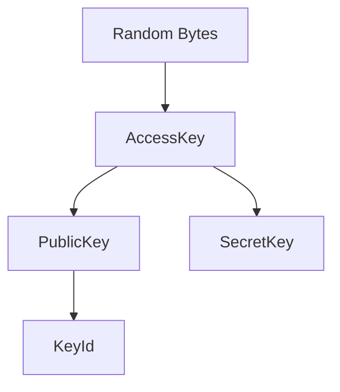

# github.com/4Players/odin-tokens-go

[][license-url]

This is a lightweight module to generate API keys and tokens used by 4Players ODIN.

4Players ODIN is a cross-platform software development kit (SDK) that enables developers to integrate voice and video chat technology into multiplayer games.

## Flowchart



## Example

```golang
import (
    "fmt"
	odin_tokens "github.com/4Players/odin-tokens-go"
)

accessKey := "<YOUR API KEY HERE>"

tokenGenerator, _ := odin_tokens.NewTokenGenerator(accessKey)
token, _ := tokenGenerator.CreateToken("room123", "user123", odin_tokens.TokenOptions{Customer: "exampleCustomer", Lifetime: 300})
fmt.Println("Generated Token:", token)
```

## Terminology

| Term      | Description                                                                                                                                         |
| --------- | --------------------------------------------------------------------------------------------------------------------------------------------------- |
| AccessKey | Gives access to the ODIN network for a customer. It is a 44 character long Base64-String, which consists of a version, random bytes and a checksum. |
| SecretKey | Generated from the AccessKey, it is based on the Ed25519-Curve and used to sign a Token generated by the customer.                                  |
| PublicKey | Generated from the AccessKey, it is based on the Ed25519-Curve and must be uploaded to 4Players so that a generated Token can be verified.          |
| KeyId     | A shortened PublicKey, included in Token, making it possible to identify what PublicKey must be used to verify the Token.                           |
| Token     | A [JWT] given to the game clients that allows them to connect to a voice/video chat room in the ODIN network.                                       |

[jwt]: https://en.wikipedia.org/wiki/JSON_Web_Token
[license-url]: https://github.com/4Players/odin-tokens-go/blob/master/LICENSE
